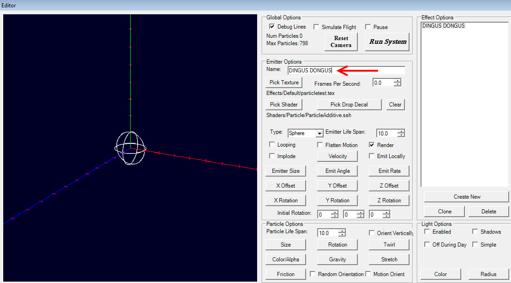
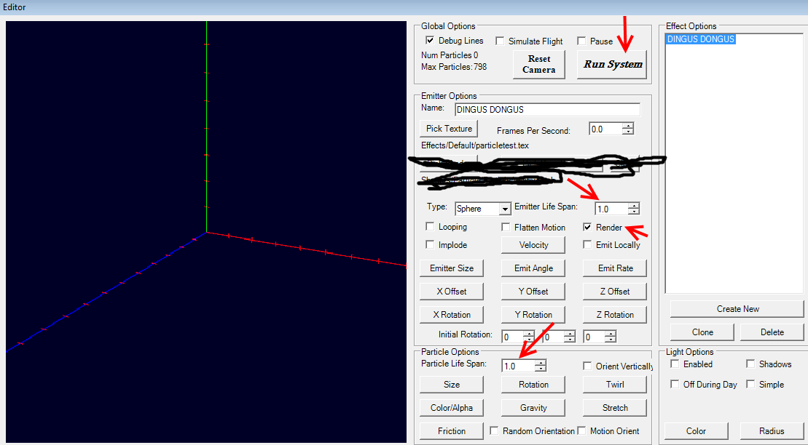
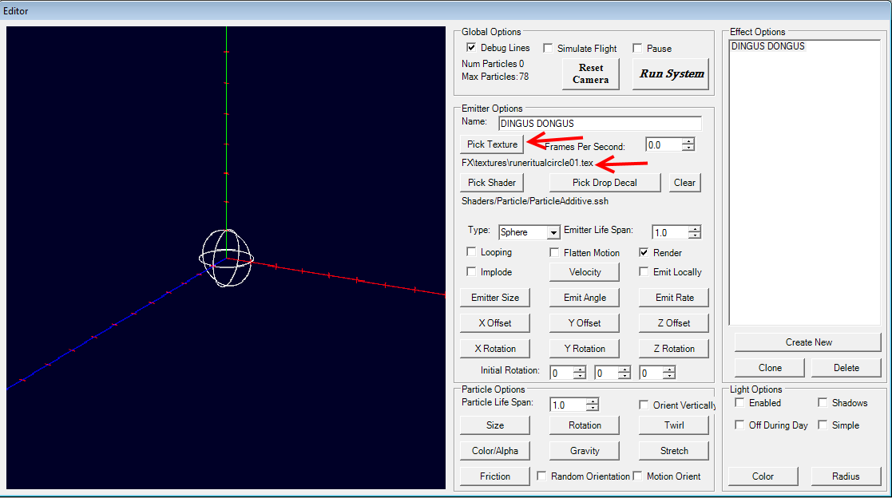
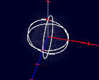
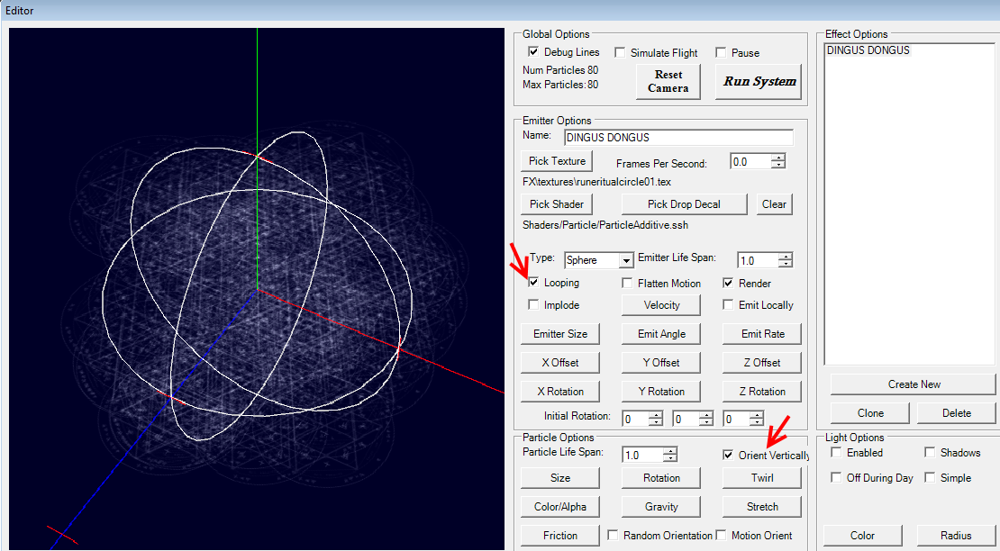

# Ceno PSEditor Tutorial

Author: [Ceno](https://forums.crateentertainment.com/u/ceno/summary)

So, you want to start using the PSEditor, huh? Great! Well, the first thing to understand about it is what it can and cannot do. It can create Particle § Effects (FX), which I’ll henceforth be calling PFX or pfx. It uses existing textures (.tex), shaders (.ssh), and some neat manipulations to enable the creation of a seemingly limitless number of 2D and 3D effects which, for the most part, are used in skills in the game (projectiles, areas-of-effect, explosions, buffs, etc.). It cannot (to my knowledge) create or manipulate 3D models (or meshes, .msh, as in Grim Dawn terminology).

What else can the PSEditor do? Well, it can crash every couple hours for no reason…

Before you get started, you should extract the gamefiles via the Asset Manager. There are many existing tutorials on how to go about that already, so I won’t describe those steps here. When you’ve done that, navigate to [Grim Dawn Installation Directory]/resources/fx/ and copy the folders within there to [Grim Dawn Installation Directory]/source/ (create this folder if it doesn’t exist yet).

Here’s my source folder:

You won’t have all the folders I do, since I’m a super awesome modder involved in a ton of other various non-PFX projects. The two red arrows point out the folders you really want for this, the green arrow points out a folder you probably want, and the blue arrow points out a folder I made myself that contains the PFX I’ve created in the PSEditor, so I can keep what I make and what GD already has separated. You may also want /fxtrails/ but I haven’t had a use for it yet. /meshfx/ seems relevant but unless you’re doing really funky stuff you shouldn’t need it at all.

From there, open up the PSEditor executable found in your [Grim Dawn Installation Directory]. You’ll be greeted with this amazing user interface:

Looking good.

You should then go to File>New in the top left, and be prepared for the program to freeze for about a half minute…

Great design, Crate.

When the editor unfreezes, you’ll get a window with a truly daunting number of buttons and options:

On the bottom, righthand side of this window, click ‘Create New’. You’ll have made a new Emitter, which is probably now tossing a crapton of ugly debug checkerboards at you. Hoorah!

My first recommendation is to give this Emitter a name. Call it whatever you want, in the ‘Emitter Options’ “Name:” field. Try to make it something descriptive unless you have the memory of a god:

Alright, let’s take a moment to actually look at what we’ve got presented to us here on this window.

I’ve scribbled out Shader selection because for the vast majority (99%+) of pfx files you create, you won’t need to bother with it.

At the top of this window is a ‘Run System’ button that ‘plays’ every Emitter that has ‘Render’ ticked underneath its ‘Emitter Life Span’ setting. ‘Run System’ essentially begins the operation of your rendering-Emitters as they would appear in-game. Pretty useful. ‘Render’ is essentially an on/off switch for a particular Emitter, controlling whether or not it actually emits any particles during the pfx’s runtime. This is mostly useful for debugging work-in-progress pfx’s, though sometimes you may wish to create a pfx with several Emitters, then make a pfx with all but one of those Emitters rendering, and save them as different files. Whether an Emitter is used during gameplay is dictated by the ‘Render’ checkbox.

‘Emitter Life Span’ and ‘Particle Life Span’, pointed out above, are two very different things not to be confused. When you create a new Emitter, they are both 10.0 (seconds). I’ve changed them to 1.0 seconds in the above image, and would usually recommend you do the same while you’re testing each new Emitter you create. An Emitter emits Particles for as long as it’s alive (Emitter Life Span) and those Particles are displayed for its own lifetime (Particle Life Span). What this means is that, in the above image, a Particle emitted when the system starts running disappears one second later, and a Particle emitted when the system finishes running also disappears one second later, meaning we can have particles for up to (Emitter Life Span + Particle Life Span) 2 seconds in our current example.

Still following along? Good, because each of these images is only going to get more complicated.

Let’s pick a texture:

Clicking the ‘Pick Texture’ box will open up a dialog box allowing you to choose a texture for this Emitter to emit as a Particle. I’ve chosen /FX/textures/runeritualcircle01.tex for this example. Click ‘Run System’, and we’ll see what happens as a result…

WTF is all this dusty crap? Well, at least we’ve gotten rid of those pesky checkerboards now…

Let’s tick ‘Looping’ and ‘Orient Vertically’ before we move on. (Also zoom in a bit to see what’s going on.)

‘Looping’ is a very useful thing for Emitters because it makes them run their entire emission pattern over and over. But, you may ask, why bother with having an Emitter Life Span field for Emitters that are on loop? A looping Emitter plays its emission pattern from start to finish, and then repeats from the start again. We’ll start to see in the next post (because I’ve hit the image limit) how to time things in an Emitter’s emission pattern.

An example of a pfx that has both looping and one-time Emitters is Maiven’s Sphere of Protection; it has an initial flash (one-time) on cast followed by the sphere itself, which is on loop. A loop continues until the game stops calling the pfx file, which is primarily controlled by database (.dbr) files.

‘Orient Vertically’ makes an Emitter orient its emitted Particles along a flat plane. This is useful for stuff that you want to have appear differently based on the camera angle. An example of a pfx that Orients Vertically is Sigil of Consumption (which, as you may have figured out, this tutorial will make a very basic version of). An example of a pfx that does not Orient Vertically is Curse of Frailty (or basically every other buff/debuff in the game). Choosing to have something not Orient Vertically will make that particular Particle appear to always be facing the camera.

In the next post, we’ll begin changing the emission pattern of our Emitter, so that it goes from a jumbled mess of nonsense sigils to a defined, interesting sigil upon the ground.