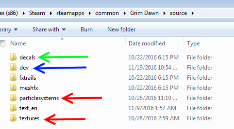
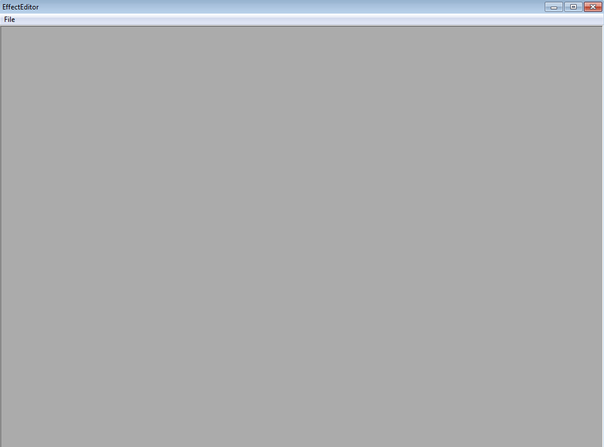
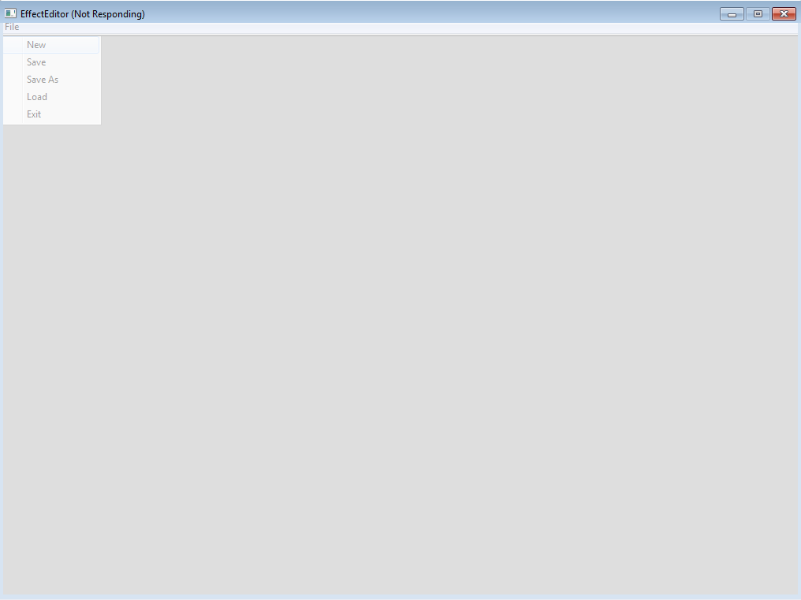
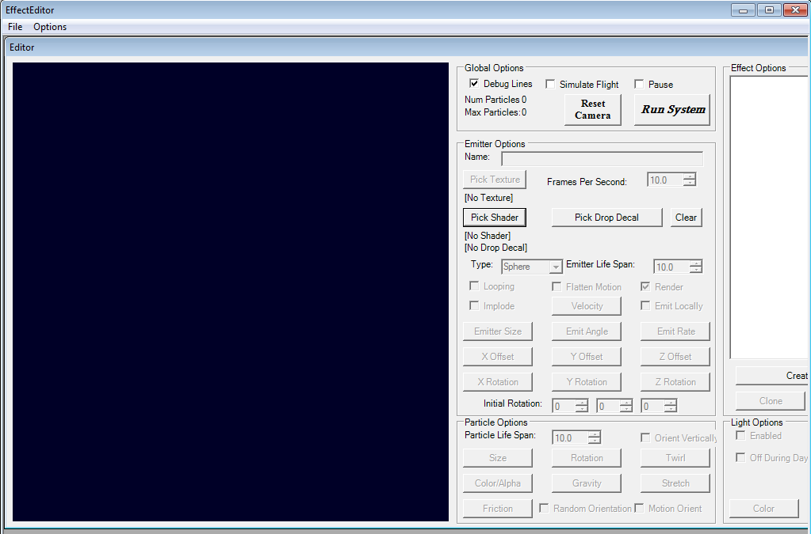
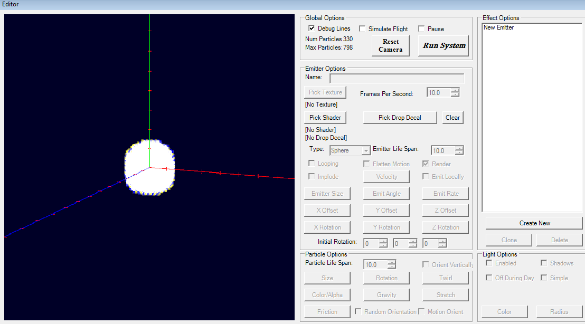

# Ceno PSEditor Tutorial

Author: [Ceno](https://forums.crateentertainment.com/u/ceno/summary)

So, you want to start using the PSEditor, huh? Great! Well, the first thing to understand about it is what it can and cannot do. It can create Particle § Effects (FX), which I’ll henceforth be calling PFX or pfx. It uses existing textures (.tex), shaders (.ssh), and some neat manipulations to enable the creation of a seemingly limitless number of 2D and 3D effects which, for the most part, are used in skills in the game (projectiles, areas-of-effect, explosions, buffs, etc.). It cannot (to my knowledge) create or manipulate 3D models (or meshes, .msh, as in Grim Dawn terminology).

What else can the PSEditor do? Well, it can crash every couple hours for no reason…

Before you get started, you should extract the gamefiles via the Asset Manager. There are many existing tutorials on how to go about that already, so I won’t describe those steps here. When you’ve done that, navigate to [Grim Dawn Installation Directory]/resources/fx/ and copy the folders within there to [Grim Dawn Installation Directory]/source/ (create this folder if it doesn’t exist yet).

Here’s my source folder:

You won’t have all the folders I do, since I’m a super awesome modder involved in a ton of other various non-PFX projects. The two red arrows point out the folders you really want for this, the green arrow points out a folder you probably want, and the blue arrow points out a folder I made myself that contains the PFX I’ve created in the PSEditor, so I can keep what I make and what GD already has separated. You may also want /fxtrails/ but I haven’t had a use for it yet. /meshfx/ seems relevant but unless you’re doing really funky stuff you shouldn’t need it at all.

From there, open up the PSEditor executable found in your [Grim Dawn Installation Directory]. You’ll be greeted with this amazing user interface:

Looking good.

You should then go to File>New in the top left, and be prepared for the program to freeze for about a half minute…

Great design, Crate.

When the editor unfreezes, you’ll get a window with a truly daunting number of buttons and options:

On the bottom, righthand side of this window, click ‘Create New’. You’ll have made a new Emitter, which is probably now tossing a crapton of ugly debug checkerboards at you. Hoorah!

