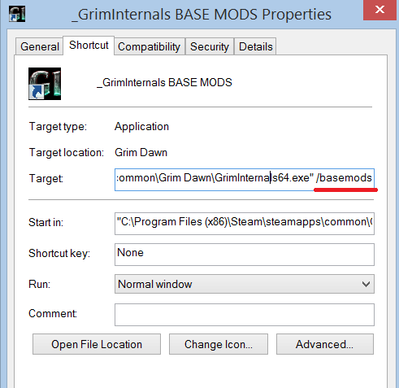

# tqFan Hard Modding Tutorial

Author: [tqFan](https://forums.crateentertainment.com/u/tqFan)

Method Discovery by [GlockenGerda](https://forums.crateentertainment.com/u/glockengerda/summary)

This new method of hardmodding is great because

You don’t modify game files (by changing gdx2.arz for example) so they don’t get overwritten by Steam updates

.arz that we mod with only contains changed files (gameengine.dbr in your example) so that you don’t need to update it usually (so much smaller chance of needing to update it)

Mod is much smaller

You can easily swap between various mods you created

Allows to run two mods at the same time - one hardmodded using this method and another in a Custom Game one on top of it.

## 1. Copy mod_name.arz (from Grim Dawn\mods\mod_name\database)
- But rename it to database.arz

- Put it in Grim Dawn\mods (so basically copy two levels higher and with a name change to database.arz)

- Also copy all .arc files (if your mod has any) there from the mod folder without changing their name

## 2. Make a shortcut to Grim Dawn .exe you’re using, this can be:
- 64 bit Grim Dawn from C:\Program Files (x86)\Steam\steamapps\common\Grim Dawn\x64\Grim Dawn.exe

- Grim Internals from C:\Program Files (x86)\Steam\steamapps\common\Grim Dawn\GrimInternals64.exe

- 32 bit Grim Dawn from C:\Program Files (x86)\Steam\steamapps\common\Grim Dawn\Grim Dawn.exe

## 3. Add /basemods (preceded with one space) as argument to the shortcut:

- You can optionally rename this shortcut so that you known it launches modded Grim Dawn

- Alternatively instead of making a shortcut you can add -basemods option in Steam Launch settings

- Launch the game from the shortcut